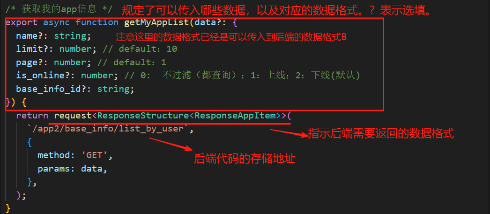
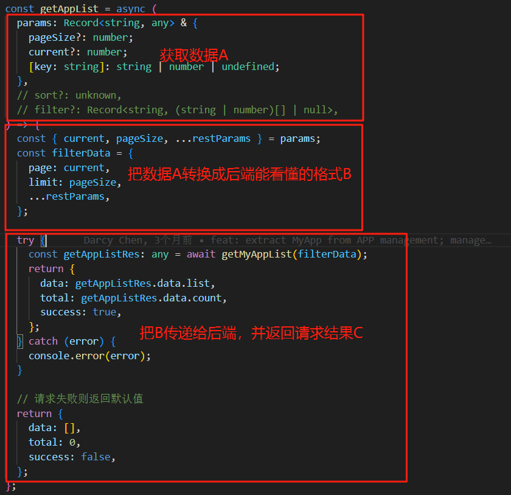

今天看了rdp-fe这个代码库。先从route文件看起，找到一个页面就寻到这个文件下，然后根据导入一路地查看，一直到把这个页面的内容业务技术等完全搞明白，，
今天就看了myapp这一个界面的，因为还不熟悉react的框架，就多看了一会，对一些函数，包括前后端的交互也有了更深入的了解。
1. request：私人助理，帮助处理和后端服务器通信时的杂事：
    1. 自动添加基础url：如 /app2/base_info/list_by_user，它会自动在前面拼上服务器的域名，如 http://api.example.com。
    2. 统一的认证处理：它会自动从localstorage中读取token，并把它添加到每个请求头header上，这样后端就可以知道你的身份。
    3. 统一的错误处理：它可以捕获错误，也可以理解后端自定义的业务错误。
    4. 统一数据转换：它可以自动处理请求参数的格式（比如转换成json），也可以自动解析从后端返回的json响应。
2. render：自定义这一列的单元格应该如何显示，比如点名册的年龄一列，如果是大等于18则显示已成年，小于则显示未成年。
3. record：相当于班级点名册中被点名（渲染到）的那个同学的所有信息（姓名，性别，年龄等等）
4. 前后端交互逻辑：
    1. app.ts里面给出了所有的用于前后端交互的api函数fun，export意味着这个函数可以被项目中其他文件调用（但并不关心这个函数的格式是否适合被所有的文件调用）。
    
    - 括号里面是接受经2转换后的数据B（注意这里不进行转换，只规定了需要进行传送的数据，具体的转换需要通过2来完成）；
    - return request<...>(...)指示了从后端期望返回的数据格式C。
    - ({})里面可能包括请求的后端url，请求方法，以及附加的传给后端的查询参数B。
    2. 由于1中app.ts里面封装的函数fun并不适合被所有的文件调用，所以在一些特定场景会通过编写一个桥梁函数来实现“翻译”的作用，即把A转换成后端能够看懂的数据格式B。
    
5. 箭头函数：
    - const 函数名 = async(传入的参数) =>{函数体,要用return指定返回值};