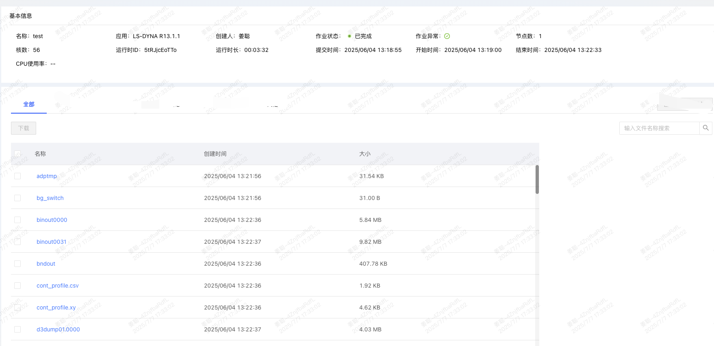

用模拟数据写了一个作业管理的详情页，react可以用mock拦截前端发出去的请求，所以可以在这里放置模拟数据。
给了一个类似这样的界面：

### **一、 页面结构设计**
首先确定了把整个页面拆分成三个组件（上basicinfocard下documenttablecard），还有一个根组件jobdetail来负责获取jobid，管理整体的加载状态并组织子组件的渲染。
-   `BasicInfoCard`：用于展示顶部的基础信息。
-   `DocumentTableCard`：用于展示下方的文档列表。
-   `JobDetail`：作为根组件，负责从 URL 获取 `jobId`，管理整体的加载状态，并组织上述子组件的渲染。
### **二、 数据交互与状态管理**
接着是和后端的交互：
#### **1. 异步获取数据**
在 `JobDetail` 组件中，使用了 `useEffect` Hook。当组件首次加载或 `jobId` 变化时，它会自动调用 `service/job.ts` 中定义的接口函数 `getJobDocuments`，从后端异步获取文档列表数据。
#### **2. 存储和处理数据**
- 使用useState创建dataSource状态，用于存储从后端获取的完整文档列表。获取到数据之后，对每条记录增加一个唯一的key属性来满足protable的要求。
*protable功能确实挺丰富，部署起来也挺快捷的。这里先把它稍微进行了一下更改再拿来用，学习文档：https://procomponents.ant.design/components/table*
### **三、 ProTable 核心功能实现**
#### **1. 行选择与批量下载**
    1. 创建了一个selectedRowKeys状态数组用来存放所有被勾选的行的key。
    2. 该列用render的方法返回一个<Checkbox>，其勾选状态与selectedRowKeys双向绑定。
    3. 该列的 title 属性也返回一个 <Checkbox>，作为“全选/取消全选”的控制器。其 checked 和 indeterminate (半选) 状态根据 selectedRowKeys 和 dataSource 的长度动态计算，实现了精确的全选逻辑。
#### **2. 点击查看日志**
在名称列，将其渲染为一个`<Button type="link">`，使其外观像一个可点击的链接。点击后，通过更新 `logModalVisible` 状态来控制 `<Modal>` 弹窗的显示与隐藏，从而展示日志内容。
#### **3. 自定义搜索**
由于 ProTable 自带搜索的自定义空间有限，我选择实现一个自定义的搜索功能：
1.  在表格外部放置一个 `<Input.Search>` 组件。
2.  监听其 `onSearch` 事件，并将输入值更新到 `searchText` 状态。
3.  创建一个派生状态 `filteredDataSource`。它通过对原始 `dataSource` 数组使用 `.filter()` 方法，根据 `searchText` 的值进行客户端实时过滤。
4.  将 `ProTable` 的 `dataSource` 属性直接指向这个过滤后的 `filteredDataSource`，从而实现了自定义搜索。

### **四、 React Hooks 学习总结**
#### **1. `useState`：组件的记忆**
- 相当于内部记忆（可修改的便签纸），用于为函数组件添加状态。
- 比如const [logModalVisible（便签纸）, setLogModalVisible（专用于修改便签纸的笔）] = useState(false)，其中logModalVisible的状态就是false。我们可以并只能通过调用setLogModalVisible(true)来更新便签纸的状态。
    -   **示例**：
    ````javascript
    function Counter() {
      // 声明一个名为 "count" 的 state 变量，初始化为 0
      const [count, setCount] = useState(0);

      return (
        <div>
          <p>You clicked {count} times</p>
          {/* 调用 setCount 来更新 state */}
          <button onClick={() => setCount(count + 1)}>
            Click me
          </button>
        </div>
      );
    }
    ````
> **与 `useParams` 的区别**：相当于外部指令（门牌号），来自于网页的url地址，而不是内部的组件。它只能读取而无法控制。比如说const { jobId } = useParams();就相当于看了一眼网页地址的门牌号，但是无法修改门牌。
#### **2. `useEffect`：处理副作用**
-   **作用**：让函数组件能够在特定时机（如渲染后、依赖变化后）执行一些份外的事情（比如去服务器拿东西），例如数据获取、DOM 操作、设置订阅等。
-   **类比**：它是一条“如果...就...”的指令。`useEffect(() => { fetchData(); }, [jobId]);` 意味着：“如果 `jobId` 变了，就去服务器获取一次新数据”。
-   **依赖数组说明**：
    -   `[dep1, dep2]`: 依赖项 `dep1` 或 `dep2` 发生变化时执行。
    -   `[]` (空数组): 只在组件**首次挂载**后执行一次。
    -   **不提供**依赖数组: **每次组件渲染后**都会执行。
比如useEffect(() => { fetchData(); }, [jobId]);
其中fetchData()意思是去服务器中拿回文件列表，jobid就是触发的ID（如果这个id发生了改变就去服务器拿回文件列表，但是如果还是同一个id的话就不需要跑一趟，用现有的就行。）
注意：①如果指令的触发条件是[]，意思即使开机后只执行一次以后都不管了；②如果没有触发条件，意思是任何一点风吹草动都要去执行这个指令。
-   **示例**：
    ````javascript
    function UserInfo({ userId }) {
      const [user, setUser] = useState(null);

      useEffect(() => {
        // 当 userId 变化时，执行这个副作用
        fetch(`/api/users/${userId}`)
          .then(res => res.json())
          .then(data => setUser(data));
      }, [userId]); // 依赖项是 userId

      if (!user) return 'Loading...';
      return <div>{user.name}</div>;
    }
    ````
#### **3. `useContext`：全局广播**
- 相当于公共广播系统。顶层组件可以通过广播发布信息，比如广播“当前主题：夜间模式”，那么所有组件（深层的也可以）只要打开收音机都会听到这个信息。
-   **示例**：
    ````javascript
    // 1. 创建 Context
    const ThemeContext = React.createContext('light');

    // 2. 在顶层组件使用 Provider 提供 value
    function App() {
      return (
        <ThemeContext.Provider value="dark">
          <Toolbar />
        </ThemeContext.Provider>
      );
    }

    // 3. 在子组件中使用 useContext 消费 value
    function ThemedButton() {
      const theme = useContext(ThemeContext); // theme 的值会是 "dark"
      return <button className={theme}>I am a {theme} button</button>;
    }
    ````

#### **4. `useMemo`：记住计算结果**
- 用于记住一个复杂的计算结果（重在**结果**），避免重复计算。
-   **示例**：
    ````javascript
    function ExpensiveComponent({ list, filter }) {
      // 只有当 list 或 filter 变化时，才会重新执行 filter 操作
      const visibleList = useMemo(() => {
        console.log('Filtering list...'); // 这个 log 不会频繁触发
        return list.filter(item => item.includes(filter));
      }, [list, filter]);

      return <div>{/* ... render visibleList ... */}</div>;
    }
    ````
#### **5. `useCallback`：记住函数本身**
用于记住一个计算公式（重在**函数实例**）。这在传递给子组件时非常有用。
-   **示例**：
    ````javascript
    function Parent() {
      const [count, setCount] = useState(0);
      
      // 使用 useCallback，这个 handleClick 函数实例在重渲染时保持不变
      const handleClick = useCallback(() => {
        console.log('Button clicked!');
      }, []); // 空依赖数组意味着函数永不改变

      return <Child onClick={handleClick} />;
    }
    // React.memo 可以防止在 props 不变时重渲染子组件
    const Child = React.memo(({ onClick }) => {
      console.log('Child rendered');
      return <button onClick={onClick}>Click me</button>;
    });
    ````
#### **6. `useRef`：多功能工具箱**
- 相当于多功能工具箱，无论怎么刷新箱子里的东西都是同一个不会丢失。修改箱子里的东西也不会触发重新渲染。
-   **作用**：返回一个可变的 ref 对象，其 `.current` 属性被初始化为传入的参数。它可以在多次渲染之间保持不变。
-   **特点**：修改 `ref.current` **不会**触发组件的重新渲染。
-   **常见用途**：
    1.  **访问 DOM 元素**：直接操作 DOM，如聚焦输入框。
    2.  **存储可变值**：存储一个与渲染无关的值，类似于实例变量。
-   **示例**：
    ````javascript
    function TextInputWithFocusButton() {
      const inputEl = useRef(null);
      
      const onButtonClick = () => {
        // `current` 指向已挂载到 DOM 上的 text input 元素
        inputEl.current.focus();
      };

      return (
        <>
          <input ref={inputEl} type="text" />
          <button onClick={onButtonClick}>Focus the input</button>
        </>
      );
    }
    ````