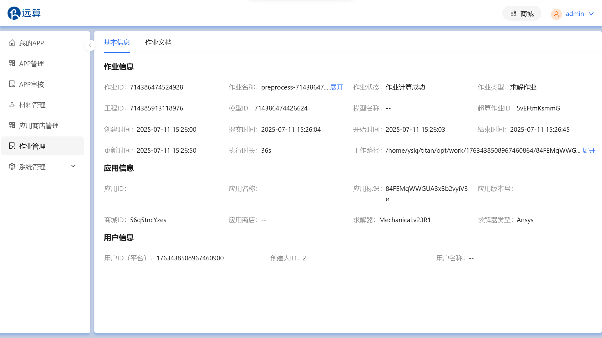

## 研发周报 - 2025年7月12日

本周我主要负责**作业管理详情**页面的开发与联调工作，并成功解决了开发过程中遇到的一系列技术挑战，确保了新功能的顺利推进和应用的整体稳定性。

### 一、本周核心工作成果

1.  **基本信息展示：** 完成了作业详情页面“基本信息”模块的开发，按照作业信息/应用信息/用户信息的分类清晰、完整地展示所有和作业管理有关的详情信息。
    

2.  **文档查看与下载**：实现了“作业文档”模块的开发，支持通过弹窗在线查看和批量下载作业相关文件，并特别优化了大文件的查看体验。
    
    
### 二、关键技术问题攻坚与解决方案

在开发过程中，我遇到并解决了一些具有代表性的技术难题，具体如下：

1.  **优化大文件的查看体验：** 针由于作业文档中可能存在体积较大的文件，因此设置首次打开时仅加载部分内容以保证弹窗秒开，同时提供“加载更多”按钮，用户点击后可加载剩余全部内容，显著提升了用户体验和前端性能。

2.  **组件拆分：** 为了增强代码的可读性，以及对页面性能进行进一步优化。我将整个页面拆分成了以下四个组件：
    *   `BasicInfoCard`：展示组件，用于展示基础信息。接收一个名为 `data` 的 prop，根据 `data` 的内容渲染出描述列表。
    *   `JobDetail`：基本信息的容器组件，用于处理逻辑和数据。负责从路由中获取 `jobId`，调用 API 来获取数据，管理状态，将数据传递给子组件 `BasicInfoCard`。
    *   `DocumentTableCard`：根组件，用于获取文件列表/展示列表/搜索/批量下载。
    *   `DocumentTableHeader`：文件搜索和操作栏组件。
    *   `FileContentModal`： 文件内容查看弹窗组件。
    *   `DocumentTable`：文档表格组件。
    *   `useFileOperations`：文件操作逻辑。

> **为何将“基本信息”拆分成两个组件（一个用于加载数据一个用于展示），而对于“作业文档”则不拆分呢？**
>
> 因为我使用了 `Tabs` 这个组件来展示“基本信息”和“作业文档”时，`Tabs` 会“懒加载”它的面板内容。只有当用户点击“作业文档”时，对应的组件才会被渲染，去请求文件列表的 API。而如果遵循容器/展示组件的模式进行拆分的话，会失去懒加载带来的性能优化，即使用户不查看文件列表数据也会被立即获取，这样会浪费网络资源并增加服务器压力。

### 三、下周工作计划

继续完善【作业详情】页面的收尾工作，并与后端进行最终确认。