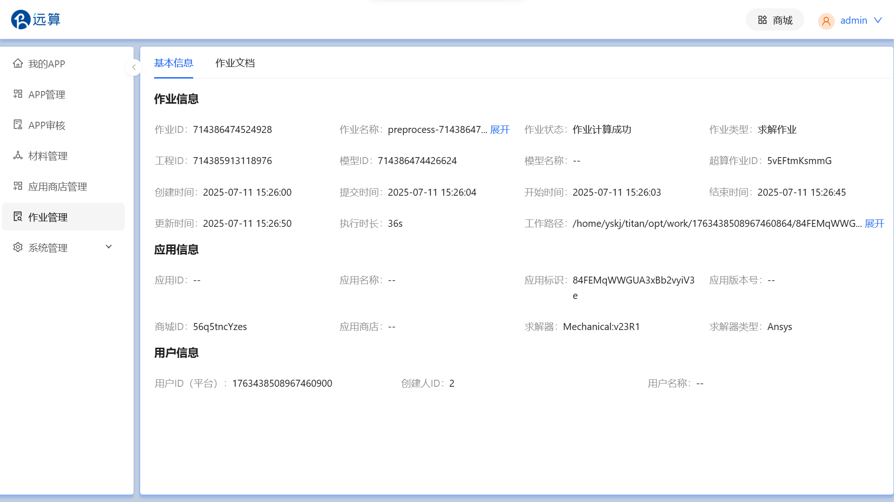

## 研发周报 - 2025年7月19日

本周我主要负责**组件管理**页面的开发与联调工作，并对上周的**作业管理详情**页面进行了功能点的完善。

### 一、本周核心工作成果

1.  **组件管理：** 完成了组件页面及组件详情页面的开发，支持用户查看组件使用情况排行榜，以及每个组件在App中的应用情况。
2.  **基本信息展示：** 完成了作业详情页面“基本信息”模块的开发，按照作业信息/应用信息/用户信息的分类清晰、完整地展示所有和作业管理有关的详情信息。
    

3.  **文档查看与下载**：实现了“作业文档”模块的开发，支持通过弹窗在线查看和批量下载作业相关文件，并特别优化了大文件的查看体验。
    
    
